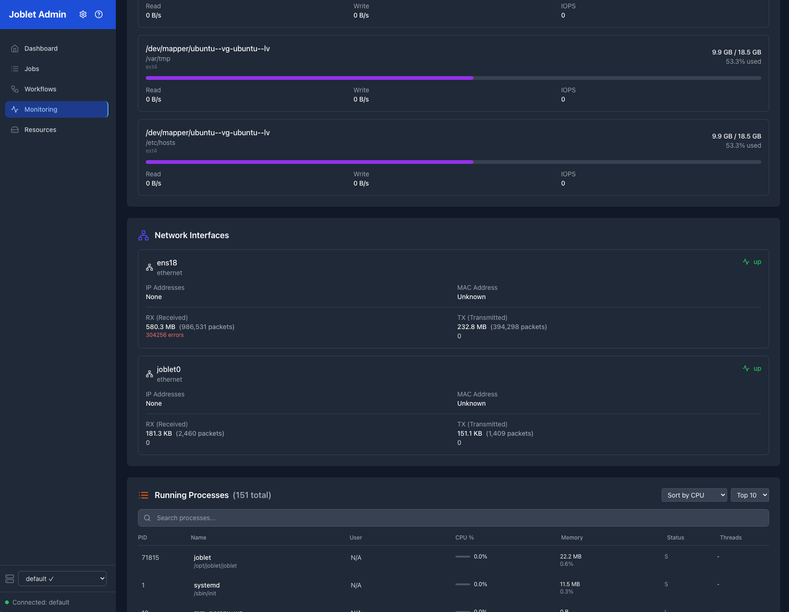

# Joblet Web Admin UI

The Joblet Web Admin UI provides a comprehensive React-based interface for managing jobs, monitoring system performance,
and visualizing workflows. The admin UI is now available as a standalone package in the [joblet-admin repository](https://github.com/ehsaniara/joblet-admin),
connecting directly to the Joblet server via gRPC.

## Table of Contents

- [Installation](#installation)
- [Getting Started](#getting-started)
- [Dashboard Overview](#dashboard-overview)
- [System Monitoring](#system-monitoring)
- [Job Management](#job-management)
- [Workflow Management](#workflow-management)
- [Administration Features](#administration-features)
- [Troubleshooting](#troubleshooting)

## Installation

### Prerequisites

- **Operating System**: Linux, macOS, or Windows
- **Node.js**: 18.x or later
- **Joblet Server**: Running and accessible from the admin UI host
- **Configuration**: Valid `~/.rnx/rnx-config.yml` with mTLS certificates

### Standalone Installation

The Admin UI is now available as a separate package from the joblet-admin repository:

```bash
# Clone the joblet-admin repository
git clone https://github.com/ehsaniara/joblet-admin
cd joblet-admin

# Install dependencies
npm install

# Start the admin interface
npm run dev

# Access at http://localhost:3000
```

**Note**: The admin UI connects directly to the Joblet server via gRPC.

### Production Installation

```bash
# Build the application
npm run build

# Start in production mode
npm start

# Or deploy the built files from dist/ directory
```

## Getting Started

### Launch the Admin UI

```bash
# Development mode (recommended)
npm run dev
# UI: http://localhost:3000
# API: http://localhost:5175

# Production mode
npm run build
npm start

# Development with custom ports
JOBLET_ADMIN_PORT=8080 npm run dev:server
```

The admin UI will be available at `http://localhost:3000` by default.

### First Login

1. Ensure your Joblet server is running and accessible
2. The admin UI automatically uses your RNX configuration for authentication
3. No separate login is required - mTLS certificates handle authentication

## Dashboard Overview

The admin UI consists of several main sections accessible via the navigation sidebar:

### 🏠 Dashboard

- **System Health Overview**: Quick status of server, jobs, and resources
- **Recent Activity**: Latest job executions and status changes
- **Quick Stats**: Active jobs, total jobs, system uptime
- **Resource Usage Summary**: CPU, memory, and disk usage at a glance

### 📊 System Monitoring

- **Real-time Metrics**: Live system performance data
- **Historical Trends**: Performance graphs over time
- **Alert Status**: System alerts and warnings

### 💼 Jobs

- **Job List**: All jobs with pagination and filtering
- **Job Details**: Individual job information and logs
- **Job Actions**: Start, stop, delete operations

### 🔄 Workflows

- **Workflow List**: Overview of all workflow definitions
- **Workflow Visualization**: Graph, tree, and timeline views
- **Workflow Execution**: Status and progress tracking

### ⚙️ Administration

- **Volume Management**: Create and manage persistent storage
- **Network Configuration**: Custom network setup
- **Runtime Management**: Available runtime environments

## System Monitoring

The System Monitoring page provides comprehensive real-time insights into your Joblet server performance.


*Real-time system metrics and performance monitoring dashboard*

### Host Information Card

Displays essential server information:

- **Hostname**: Server identifier
- **Platform**: Operating system and version
- **Architecture**: CPU architecture (e.g., amd64, arm64)
- **Kernel Version**: Linux kernel version
- **Uptime**: Server uptime in string format
- **Cloud Environment**: Cloud provider, instance type, region (if applicable)

### CPU Details Card

Real-time CPU monitoring:

- **CPU Model**: Processor model and specifications
- **Core Count**: Physical and logical cores
- **Overall Usage**: Current CPU utilization percentage
- **Per-Core Usage**: Individual core utilization with visual bars
- **Load Average**: 1, 5, and 15-minute load averages
- **Temperature**: CPU temperature (if available)

### Memory Details Card

Comprehensive memory monitoring:

- **Total Memory**: Available system memory
- **Used Memory**: Currently allocated memory
- **Available Memory**: Free memory available for allocation
- **Memory Usage**: Percentage utilization with progress bar
- **Buffers/Cache**: System buffer and cache usage
- **Swap Usage**: Swap space utilization (if configured)

### Disk Information Card

Storage monitoring across all mount points:

- **Device Information**: Device names and mount points
- **Filesystem Types**: ext4, xfs, etc.
- **Usage Statistics**: Used/total space with percentage
- **Color-coded Alerts**: Green (normal), yellow (75%+), red (90%+)
- **I/O Statistics**: Read/write rates and IOPS (when available)

### Network Interfaces Card

Network monitoring for all interfaces:

- **Interface Details**: Interface names and types (ethernet, wireless)
- **Status Indicators**: Up/down status with color coding
- **Traffic Statistics**: RX/TX bytes and packet counts
- **Error Rates**: Packet drops and transmission errors
- **IP Addresses**: Assigned IP addresses per interface
- **MAC Addresses**: Hardware addresses

### Process Monitor Card

Real-time process monitoring:

- **Top Processes**: Sorted by CPU or memory usage
- **Process Details**: PID, name, command, user
- **Resource Usage**: CPU percentage and memory consumption
- **Status Information**: Process state (running, sleeping, etc.)
- **Search and Filter**: Find specific processes quickly
- **Configurable Display**: Show top 10, 25, or 50 processes

### Interactive Features

- **Real-time Updates**: Toggle real-time monitoring on/off
- **Manual Refresh**: Force refresh system information
- **Responsive Design**: Optimized for desktop and tablet viewing
- **Dark Theme**: Professional dark interface reduces eye strain


*Detailed system metrics with CPU, memory, and process monitoring*

## Job Management

### Job List View

The Jobs page provides a comprehensive overview of all job executions:

#### Features

- **Paginated Display**: Configurable page sizes (5, 10, 25, 50, 100 jobs)
- **Sortable Columns**: Click column headers to sort by any field
- **Real-time Updates**: Job status updates automatically
- **Bulk Operations**: Select multiple jobs for batch operations

#### Job Information Displayed

| Column       | Description                                                 |
|--------------|-------------------------------------------------------------|
| **Job ID**   | Unique identifier for the job                               |
| **Status**   | Current execution status (running, completed, failed, etc.) |
| **Command**  | The command or script being executed                        |
| **Runtime**  | Runtime environment (if specified)                          |
| **Network**  | Network configuration                                       |
| **Started**  | Job start timestamp                                         |
| **Duration** | Execution time (for completed jobs)                         |
| **Actions**  | Quick action buttons (stop, logs, delete)                   |

#### Job Status Indicators

- 🟢 **Completed**: Job finished successfully
- 🟡 **Running**: Job is currently executing
- 🔴 **Failed**: Job encountered an error
- ⏸️ **Stopped**: Job was manually stopped
- ⏳ **Scheduled**: Job is scheduled for future execution

### Job Details View

Click on any job ID to view detailed information:

#### Job Information

- **Execution Details**: Start time, duration, exit code
- **Resource Usage**: CPU, memory, and disk utilization
- **Configuration**: Runtime, network, volumes, resource limits
- **Scheduling**: Schedule information (if applicable)

#### Real-time Logs

- **Live Log Stream**: Real-time output from the job
- **Log History**: Complete log history with timestamps
- **Search and Filter**: Find specific log entries
- **Auto-scroll**: Automatically follow new log entries

#### Job Actions

- **Stop Job**: Terminate a running job
- **Restart Job**: Re-execute a completed job
- **Download Logs**: Export logs to a file
- **Delete Job**: Remove job from history

### Advanced Filtering

Filter jobs by various criteria:

- **Status**: Show only running, completed, or failed jobs
- **Date Range**: Filter by execution date
- **Runtime**: Filter by runtime environment
- **Network**: Filter by network configuration
- **Command Pattern**: Search by command text

## Workflow Management

The Workflows section provides powerful tools for managing complex job orchestrations.


*Workflow visualization and management interface with dependency graph*

### Workflow List View

#### Overview Display

- **Workflow Summary**: Name, description, and job count
- **Status Indicators**: Overall workflow status
- **Execution History**: Recent workflow runs
- **Quick Actions**: Execute, edit, or delete workflows

#### Workflow Information

- **Job Count**: Total number of jobs in the workflow
- **Dependencies**: Number of job dependencies
- **Estimated Duration**: Expected execution time
- **Last Execution**: Last run timestamp and status

### Workflow Detail Views

Click on any workflow to access detailed visualization options:

#### Graph View

- **Dependency Graph**: Visual representation of job dependencies
- **Interactive Nodes**: Click nodes to view job details
- **Status Overlay**: Real-time execution status on graph
- **Zoom and Pan**: Navigate large workflows easily

#### Tree View

- **Hierarchical Display**: Tree structure showing job relationships
- **Expandable Nodes**: Drill down into job groups
- **Status Indicators**: Visual status for each job
- **Dependency Lines**: Clear dependency relationships

#### Timeline View

- **Execution Timeline**: Chronological view of job execution
- **Duration Bars**: Visual representation of job duration
- **Parallel Execution**: Show concurrent job execution
- **Critical Path**: Highlight longest execution path

### Workflow Execution

#### Starting Workflows

- **Execute Button**: Start workflow from the workflow list
- **Parameter Input**: Provide runtime parameters (if required)
- **Validation**: Pre-execution validation of dependencies
- **Confirmation**: Review execution plan before starting

#### Monitoring Execution

- **Real-time Updates**: Live status updates as jobs execute
- **Progress Tracking**: Overall workflow progress percentage
- **Job Status**: Individual job status within the workflow
- **Error Handling**: Failed job indicators and error messages

#### Workflow Actions

- **Stop Workflow**: Halt all running jobs in the workflow
- **Retry Failed**: Re-execute only failed jobs
- **View Logs**: Access logs for all jobs in the workflow
- **Export Results**: Download workflow execution report

## Administration Features

### Volume Management

Create and manage persistent storage volumes:

#### Volume Operations

- **Create Volume**: Specify name, size, and type
- **Mount Volumes**: Attach volumes to jobs
- **Delete Volumes**: Remove unused volumes
- **Usage Monitoring**: Track volume space utilization

#### Volume Information

- **Size and Usage**: Current space utilization
- **Mount Points**: Where volumes are currently mounted
- **Access Permissions**: Volume access controls
- **Backup Status**: Backup and snapshot information

### Network Configuration

Manage custom networks for job isolation:

#### Network Features

- **Create Networks**: Define custom network configurations
- **CIDR Configuration**: Specify IP address ranges
- **Network Isolation**: Isolate job groups
- **Bridge Configuration**: Inter-network communication

#### Network Monitoring

- **Active Connections**: Current network usage
- **Traffic Statistics**: Network throughput monitoring
- **Security Policies**: Applied network security rules

### Runtime Management

Monitor and manage runtime environments:

#### Runtime Information

- **Available Runtimes**: List of installed runtime environments
- **Package Lists**: Installed packages in each runtime
- **Health Checks**: Runtime availability and status
- **Usage Statistics**: Runtime utilization metrics

#### Runtime Actions

- **Test Runtime**: Verify runtime functionality
- **Runtime Details**: View detailed runtime information
- **Update Status**: Check for runtime updates

### System Configuration

#### User Preferences

- **Theme Selection**: Light/dark theme options
- **Refresh Intervals**: Configure auto-refresh rates
- **Page Sizes**: Default pagination settings
- **Notification Settings**: Alert and notification preferences

#### Server Configuration

- **Connection Settings**: Server endpoint configuration
- **Authentication**: mTLS certificate management
- **Security Settings**: Access control and permissions

## Troubleshooting

### Common Issues

#### Admin UI Won't Start

```bash
# Check if ports are already in use
lsof -i :3000  # UI port
lsof -i :5175  # API port

# Try different ports
JOBLET_ADMIN_PORT=8080 npm run dev:server
PORT=8081 npm run dev:ui

# Check Node.js installation
node --version
npm --version
```

#### Connection Issues

```bash
# Verify server connectivity
rnx job list

# Check configuration
cat ~/.rnx/rnx-config.yml

# Test server connection
rnx monitor status

# Check admin server logs
npm run dev:server
# Look for gRPC connection errors
```

#### Performance Issues

- **Slow Loading**: Increase browser cache, check network connectivity
- **Memory Usage**: Close unused browser tabs, restart admin UI
- **Update Frequency**: Reduce real-time update frequency in settings

### Logs and Debugging

#### Admin UI Logs

```bash
# View admin server logs
npm run dev:server
# Server logs will show gRPC connection status

# View UI development logs
npm run dev:ui
# React development server logs

# Check browser console
# Open browser developer tools (F12)
# Look for JavaScript errors in console
```

#### Server-side Logs

```bash
# Check Joblet server logs
sudo journalctl -u joblet -f

# Check system resources
rnx monitor status
```

### Getting Help

- **Admin UI Issues**: [Report bugs](https://github.com/ehsaniara/joblet-admin/issues)
- **Server Issues**: [Report bugs](https://github.com/ehsaniara/joblet/issues)
- **Documentation**: [Complete docs](https://github.com/ehsaniara/joblet/tree/main/docs)

### Feature Requests

The admin UI is actively developed. To request new features:

1. Check existing [GitHub issues](https://github.com/ehsaniara/joblet-admin/issues)
2. Create a new feature request with detailed description
3. Include use cases and expected behavior
4. Add mockups or wireframes if applicable

## Security Considerations

### Authentication

- **mTLS Certificates**: Uses same certificates as RNX CLI
- **No Separate Login**: Authentication handled by client certificates
- **Secure by Default**: All communication encrypted

### Network Security

- **Local Access**: Admin UI binds to localhost by default
- **Firewall**: Configure firewall rules for remote access
- **HTTPS**: Consider reverse proxy with HTTPS for remote access

### Data Protection

- **No Persistent Storage**: Admin UI doesn't store sensitive data
- **Session Management**: Uses stateless authentication
- **Audit Trail**: All actions logged by Joblet server

---

For more information, see the [main documentation](README.md) or visit
the [GitHub repository](https://github.com/ehsaniara/joblet).