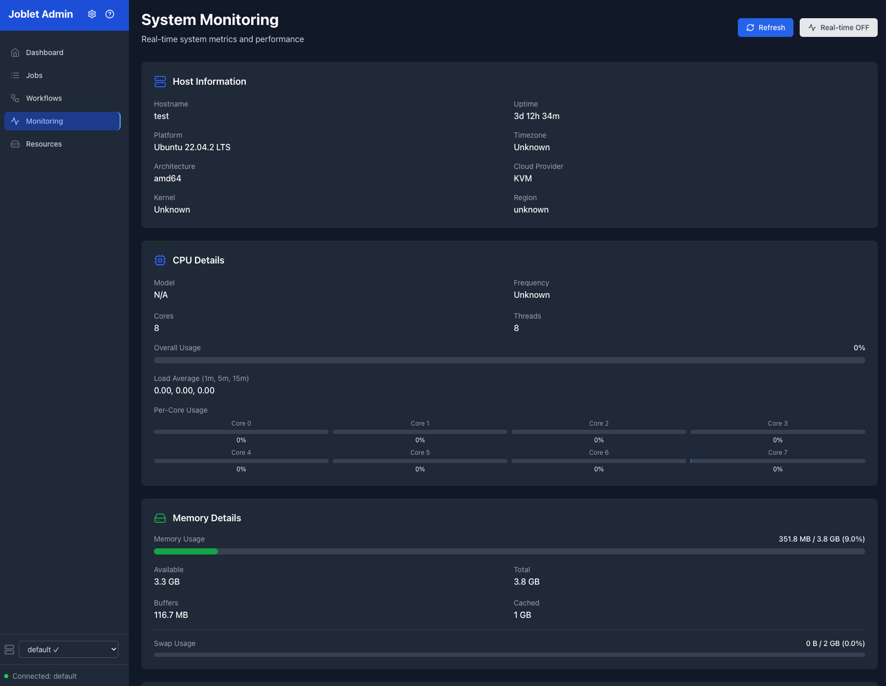
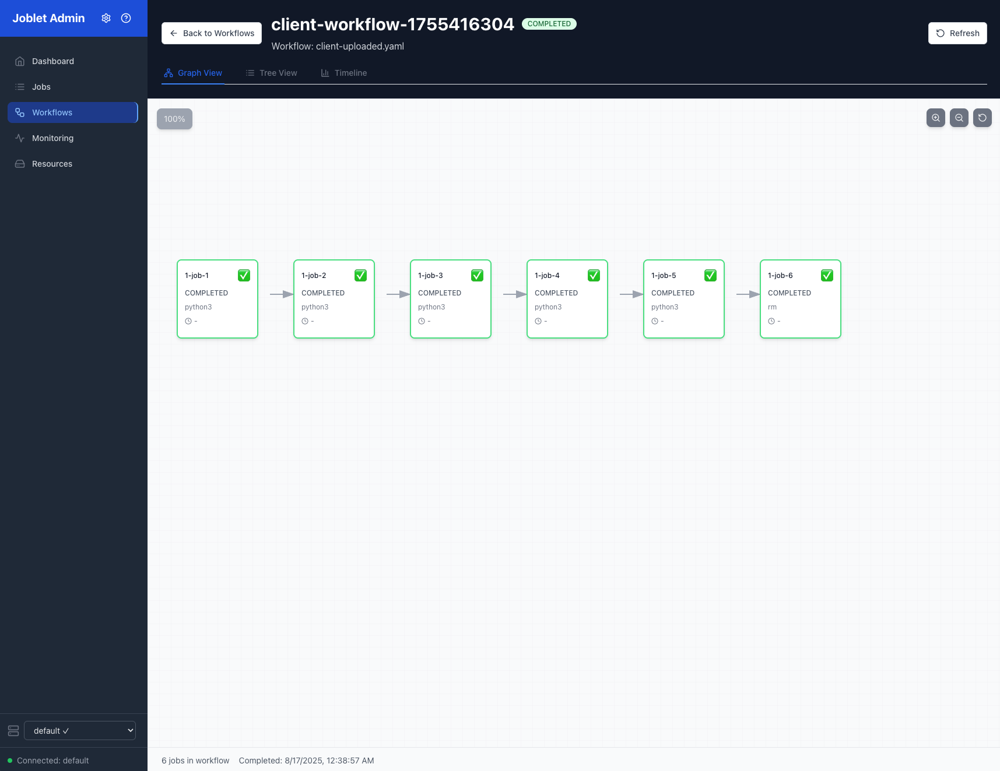

# Joblet: Linux Job Execution Platform

Joblet is a Linux job execution platform that uses namespaces and cgroups for process isolation and resource management.

## Overview

Joblet runs jobs in isolated Linux namespaces with configurable resource limits. It provides job scheduling, workflow
orchestration, and monitoring through a gRPC API and CLI client.

### Key Features

- **Process Isolation**: Jobs run in separate PID, network, mount, IPC, and UTS namespaces
- **Resource Control**: CPU, memory, and I/O limits using cgroups v2
- **Job Scheduling**: Time-based scheduling and dependency management
- **Network Management**: Custom networks with isolation and traffic control
- **Volume Management**: Persistent storage with size and type controls
- **Monitoring**: Built-in metrics collection and log streaming

### Authentication & Security

- mTLS with certificate-based authentication
- Role-based access control (admin, user, readonly)
- Process isolation prevents privilege escalation
- Network isolation between jobs

### Client & Interface

- **RNX CLI**: Cross-platform client (Linux, macOS, Windows)
- **Web UI**: React-based management interface
- **Log Streaming**: Real-time log output with filtering
- **Runtime Environments**: Pre-built Python, Python ML, and Java runtimes

## Web Interface

### System Monitoring



### Workflow Management



## Use Cases

### **CI/CD & DevOps**

```bash
# Run jobs with pre-built runtime environments
rnx job run --runtime=python-3.11-ml pytest tests/
rnx job run --runtime=openjdk-21 --upload=pom.xml --upload=src/ mvn clean install
```

### **Data Engineering & Analytics**

```bash
# Isolated data processing with resource limits
rnx job run --max-memory=8192 --max-cpu=400 \
        --volume=data-lake \
        --runtime=python-3.11-ml \
        python process_big_data.py
```

### **Microservices & Testing**

```bash
# Network-isolated service testing
rnx network create test-env --cidr=10.10.0.0/24
rnx job run --network=test-env --runtime=openjdk-21 ./service-a
rnx job run --network=test-env --runtime=python-3.11-ml ./service-b
```

### **Workflow Orchestration**

```yaml
# ml-pipeline.yaml
jobs:
  data-extraction:
    command: "python3"
    args: [ "extract.py" ]
    runtime: "python-3.11-ml"
    resources:
      max_memory: 2048
      max_cpu: 100

  model-training:
    command: "python3"
    args: [ "train.py" ]
    runtime: "python-3.11-ml"
    requires:
      - data-extraction: "COMPLETED"
    resources:
      max_memory: 8192
      max_cpu: 400
```

```bash
# Execute and monitor workflow with job names
rnx job run --workflow=ml-pipeline.yaml
rnx job status --workflow a1b2c3d4-e5f6-7890-1234-567890abcdef

# View workflow status with original YAML content (available from any workstation)
rnx job status --workflow --detail a1b2c3d4-e5f6-7890-1234-567890abcdef

# Output shows human-readable job names and dependencies:
# JOB UUID        JOB NAME             STATUS       EXIT CODE  DEPENDENCIES        
# -----------------------------------------------------------------------------------------
# f47ac10b-...    data-extraction      COMPLETED    0          -                   
# a1b2c3d4-...    model-training       RUNNING      -          data-extraction     
```

### **SRE & Reliability Engineering**

```bash
# Resource-bounded health checks with timeout
rnx job run --max-cpu=10 --max-memory=64 \
        --runtime=python-3.11 \
        python health_check.py

# Isolated incident response tooling
rnx job run --network=isolated \
        --volume=incident-logs \
        ./debug-analyzer.sh
```

### **AI Agent Development**

```bash
# Multi-agent system with isolation
rnx job run --max-memory=4096 --runtime=python-3.11-ml \
        python agent_coordinator.py

rnx job run --max-memory=2048 --runtime=python-3.11-ml \
        --network=agent-net \
        python data_processing_agent.py

rnx job run --max-memory=1024 --runtime=python-3.11-ml \
        --network=agent-net \
        python monitoring_agent.py
```

## Architecture

### Linux Integration

- **Cgroups v2**: Resource control and accounting
- **Namespaces**: PID, network, mount, IPC, UTS isolation
- **Direct Execution**: Jobs run as native Linux processes
- **System Integration**: Uses standard Linux interfaces

### Security Model

- **mTLS**: Certificate-based authentication for all communications
- **Role-Based Access**: Admin, user, and readonly permissions
- **Process Isolation**: Jobs run in separate namespaces
- **Resource Limits**: Configurable CPU, memory, and I/O constraints

### **Scalable Design**

- **Stateless Architecture**: Easy horizontal scaling
- **Event-Driven**: Real-time job state management
- **API-First**: Full gRPC API for integrations
- **Web Management**: Modern React UI for operations teams (macOS via Homebrew)

## 📚 Complete Documentation

### Getting Started

- [**Quick Start Guide**](./QUICKSTART.md) - Get up and running in 5 minutes
- [**Installation Guide**](./INSTALLATION.md) - Detailed installation for all platforms
- [**Configuration**](./CONFIGURATION.md) - Complete configuration reference

### User Guides

- [**RNX CLI Reference**](./RNX_CLI_REFERENCE.md) - Complete command reference with examples
- [**Job Execution Guide**](./JOB_EXECUTION.md) - Running jobs with resource limits and isolation
- [**Workflows Guide**](./WORKFLOWS.md) - YAML workflows with dependencies and orchestration
- [**Runtime System**](./RUNTIME_SYSTEM.md) - Pre-built environments for instant execution
- [**Volume Management**](./VOLUME_MANAGEMENT.md) - Persistent and temporary storage
- [**Network Management**](./NETWORK_MANAGEMENT.md) - Network isolation and custom networks
- [**Web Admin UI**](./ADMIN_UI.md) - React-based interface for visual management

### Advanced Topics

- [**Security Guide**](./SECURITY.md) - mTLS, authentication, and best practices
- [**Runtime Deployment**](./RUNTIME_DEPLOYMENT.md) - Zero-contamination runtime deployment
- [**Runtime Advanced Scenarios**](./RUNTIME_ADVANCED_SCENARIOS.md) - Enterprise patterns and CI/CD
- [**Deployment Guide**](./DEPLOYMENT.md) - Production deployment strategies
- [**Troubleshooting**](./TROUBLESHOOTING.md) - Common issues and solutions

### Reference

- [**API Reference**](./API.md) - Complete gRPC API documentation
- [**Architecture**](./DESIGN.md) - System design and architecture deep-dive
- [**Storage Guide**](./STORAGE.md) - Data persistence and storage management
- [**Process Isolation**](./PROCESS_ISOLATION.md) - Complete guide to process isolation and multi-process jobs
- [**Security Analysis**](./ISOLATION_SECURITY_ANALYSIS.md) - Service-based isolation security analysis
- [**Runtime Cleanup**](./RUNTIME_ISOLATION_CLEANUP.md) - Runtime isolation cleanup design and implementation

## 🚀 Quick Start Example

```bash
# Install Joblet Server on Linux (see Installation Guide for details)
# Download from GitHub releases and run installation script

# Run your first job
rnx job run echo "Hello, Joblet!"

# Create a workflow
cat > ml-pipeline.yaml << EOF
jobs:
  analyze:
    command: "python3"
    args: ["analyze.py", "--data", "/data/input.csv"]
    runtime: "python-3.11-ml"
    volumes: ["data-volume"]
EOF

# Execute the workflow
rnx job run --workflow=ml-pipeline.yaml
```

## 🎮 Quick Command Reference

### Job Execution

```bash
# Run basic commands
rnx job run echo "Hello World"
rnx job run --runtime=python-3.11-ml python script.py
rnx job run --runtime=openjdk-21 java MyApp

# Resource limits
rnx job run --max-memory=2048 --max-cpu=200 intensive-task

# Multi-process jobs (see PROCESS_ISOLATION.md for details)
rnx job run --runtime=python-3.11-ml bash -c "sleep 30 & sleep 40 & ps aux"
rnx job run --runtime=python-3.11-ml bash -c "task1 & task2 & wait"
```

### Runtime Management

```bash
# List available runtimes (Python, Python ML, Java)
rnx runtime list

# Get runtime information
rnx runtime info python-3.11-ml

# Install runtimes
rnx runtime install python-3.11-ml
rnx runtime install python-3.11
rnx runtime install openjdk-21
rnx runtime install graalvmjdk-21

# Remove runtimes
rnx runtime remove python-3.11-ml

# Test runtime functionality
rnx runtime test openjdk-21
```

### Network & Storage

```bash
# Create isolated networks
rnx network create my-network --cidr=10.0.0.0/24

# Create persistent volumes
rnx volume create data-vol --size=10GB

# Use in jobs
rnx job run --network=my-network --volume=data-vol app
```

## 🎯 Value Proposition

### **For DevOps Teams**

- **Simplified Infrastructure**: No container registry or image management
- **Better Security**: Process isolation without container escape risks
- **Cost Savings**: Lower resource overhead and operational complexity
- **Native Integration**: Works with existing Linux infrastructure

### Development

- Job startup without container image builds
- Direct process and filesystem access for debugging
- Pre-built runtime environments (Python, Java, ML)
- CLI and web UI tools

### Operations

- Built-in metrics and monitoring
- mTLS authentication and RBAC
- Web interface for job management
- Resource limit enforcement

### Site Reliability

- Process isolation prevents failure cascade
- Configurable resource limits
- Monitoring and alerting integration
- Direct process access for debugging

### AI/ML Workloads

- Isolated execution for multiple agents
- Resource controls for ML workloads
- Pre-built ML environments with common packages
- Workflow orchestration for agent chains

---

## Getting Started

See the [Quick Start Guide](./QUICKSTART.md) for installation and basic usage.