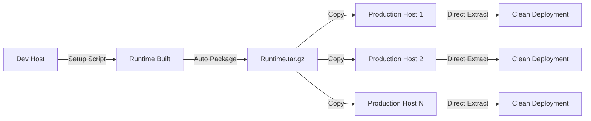

# Runtime Deployment Guide

## Overview

The Joblet Runtime Deployment system enables **zero-contamination** deployment of complex runtime environments. Build runtimes once on development hosts, then deploy clean packages to production without installing any build tools or dependencies.

## 🏗️ Deployment Architecture

### Build-Once, Deploy-Many Approach



## 📦 Deployment Method: Direct Extraction

For all runtime deployments, direct extraction is the standard and most reliable method:

```bash
# Pre-built packages available in examples/packages/:
# - python-3.11-ml-runtime.tar.gz (226MB)
# - java-17-runtime-complete.tar.gz (193MB)
# - java-21-runtime-complete.tar.gz (208MB)

# Extract directly to runtimes directory
sudo tar -xzf python-3.11-ml-runtime.tar.gz -C /opt/joblet/runtimes/python/
sudo tar -xzf java-17-runtime-complete.tar.gz -C /opt/joblet/runtimes/java/

# Set proper permissions
sudo chown -R joblet:joblet /opt/joblet/runtimes/

# Verify deployment
rnx runtime list
```

This method works for all runtime sizes and provides the simplest, most reliable deployment experience.

## 📦 Step-by-Step Deployment

### Step 1: Build Runtime (Development Host)

On a development or build host where contamination is acceptable:

```bash
# Python 3.11 + ML Runtime (~226MB package)
sudo ./runtimes/python-3.11-ml/setup_python_3_11_ml.sh

# Java 17 LTS Runtime (~193MB package)
sudo ./runtimes/java-17/setup_java_17.sh

# Java 21 LTS Runtime (~208MB package)
sudo ./runtimes/java-21/setup_java_21.sh

# Node.js 18 LTS Runtime (~150MB package)  
sudo ./runtimes/node-18/setup_node_18.sh

# Java 17 LTS Runtime (~200MB package)
sudo ./runtimes/java-17/setup_java_17.sh
```

Each script automatically:
1. **Builds** the complete runtime environment
2. **Installs** all dependencies and packages
3. **Creates** deployment package at `/tmp/runtime-deployments/[runtime]-runtime.zip`
4. **Includes** metadata for auto-detection during deployment

### Step 2: Copy Runtime Package

Transfer the deployment package to your administration workstation:

```bash
# Copy from build host
scp build-host:/tmp/runtime-deployments/python-3.11-ml-runtime.zip .
scp build-host:/tmp/runtime-deployments/node-18-runtime.zip .
scp build-host:/tmp/runtime-deployments/java-17-runtime.zip .
```

### Step 3: Deploy to Production Hosts

Deploy to any number of production hosts with zero contamination:

```bash
# Deploy to production servers
sudo unzip python-3.11-ml-runtime.zip -d /opt/joblet/runtimes/

# Multi-host deployment
for host in prod-01 prod-02 prod-03; do
    scp python-3.11-ml-runtime.zip admin@$host:/tmp/
    ssh admin@$host "sudo unzip /tmp/python-3.11-ml-runtime.zip -d /opt/joblet/runtimes/"
done
```

### Step 4: Verify Deployment

```bash
# List available runtimes
rnx runtime list

# Test runtime functionality  
rnx runtime test python-3.11-ml
rnx runtime info python-3.11-ml

# Run jobs using deployed runtime
rnx run --runtime=python-3.11-ml python script.py
```

## 🎯 Available Runtimes

| Runtime | Package Size | Contents | Use Case |
|---------|-------------|-----------|----------|
| **python-3.11-ml** | ~700MB | Python 3.11 + NumPy, Pandas, Scikit-learn, Matplotlib, TensorFlow, PyTorch | ML/AI, Data Analysis |
| **node-18** | ~150MB | Node.js 18 LTS + npm, Express, TypeScript, ESLint | Web Development, APIs |
| **java-17** | ~200MB | OpenJDK 17 LTS + Maven, common libraries | Enterprise Java Apps |

## 🔒 Security & Isolation

### Zero-Contamination Guarantee

**Production hosts require NO:**
- Compilers (gcc, g++, javac)
- Package managers (apt, yum, npm, pip)
- Build tools (make, cmake, maven)
- Development headers (python3-dev, etc.)

**Only requirement:**
- Joblet daemon running
- RNX client with runtime package

### Runtime Isolation

Each deployed runtime is completely isolated:
- **Filesystem**: Read-only mount in job containers
- **Environment**: Automatic PATH/library setup
- **Dependencies**: Self-contained, no host contamination
- **Permissions**: Proper security context

## 🚀 Advanced Deployment Scenarios

### Automated CI/CD Integration

```yaml
# GitHub Actions example
name: Deploy Runtime
on:
  push:
    paths: ['runtimes/**']

jobs:
  build-and-deploy:
    runs-on: ubuntu-latest
    steps:
      - name: Build Runtime
        run: sudo ./runtimes/python-3.11-ml/setup_python_3_11_ml.sh
      
      - name: Upload Artifact
        uses: actions/upload-artifact@v3
        with:
          name: python-runtime
          path: /tmp/runtime-deployments/python-3.11-ml-runtime.zip
      
      - name: Deploy to Production
        run: |
          for host in ${{ secrets.PROD_HOSTS }}; do
            scp python-3.11-ml-runtime.zip admin@$host:/tmp/
            ssh admin@$host "sudo unzip /tmp/python-3.11-ml-runtime.zip -d /opt/joblet/runtimes/"
          done
```

### Container-based Build Environment

```bash
# Use Docker for isolated builds
docker run -it --rm -v $(pwd)/packages:/output ubuntu:22.04 bash

# Inside container
apt update && apt install -y git
git clone https://github.com/ehsaniara/joblet.git
cd joblet
sudo ./runtimes/python-3.11-ml/setup_python_3_11_ml.sh
cp /tmp/runtime-deployments/* /output/
```

### Batch Runtime Updates

```bash
#!/bin/bash
# Update all runtimes across fleet

RUNTIMES=("python-3.11-ml" "node-18" "java-17")
HOSTS=("prod-01" "prod-02" "prod-03")

for runtime in "${RUNTIMES[@]}"; do
    echo "Deploying $runtime to all hosts..."
    for host in "${HOSTS[@]}"; do
        echo "  -> $host"
        scp "${runtime}-runtime.zip" admin@$host:/tmp/
        ssh admin@$host "sudo unzip /tmp/${runtime}-runtime.zip -d /opt/joblet/runtimes/"
    done
done
```

## 🐛 Troubleshooting

### Runtime Deployment Options

The standard deployment method works for all runtime sizes:

```bash
# Option 1: Direct extraction (standard method)
scp python-3.11-ml-runtime.zip admin@prod-host:/tmp/
ssh admin@prod-host "sudo unzip /tmp/python-3.11-ml-runtime.zip -d /opt/joblet/runtimes/"

# Option 2: Download from GitHub releases (production)
ssh admin@prod-host
wget https://github.com/ehsaniara/joblet/releases/download/v1.0/python-3.11-ml-runtime.zip
sudo unzip python-3.11-ml-runtime.zip -d /opt/joblet/runtimes/
rm python-3.11-ml-runtime.zip

# Option 3: Use shared storage/NFS
cp python-3.11-ml-runtime.zip /shared/nfs/
ssh admin@prod-host "sudo unzip /shared/nfs/python-3.11-ml-runtime.zip -d /opt/joblet/runtimes/"
```

After extraction, the runtime is immediately available:
```bash
rnx runtime list              # Runtime appears in list
rnx runtime test python-3.11-ml  # Test the runtime
rnx run --runtime=python-3.11-ml python script.py  # Use it
```

### Deployment Verification

```bash
# Check runtime installation
rnx runtime list | grep python-3.11-ml

# Test runtime functionality
rnx runtime test python-3.11-ml

# Run simple test job
rnx run --runtime=python-3.11-ml python -c "import numpy; print('✅ Runtime working')"
```

### Common Issues

**Issue**: `runtime error: invalid zip file`
**Solution**: Ensure zip was created properly, not corrupted during transfer

**Issue**: `could not detect runtime name from zip structure`  
**Solution**: Verify zip contains proper directory structure with metadata

**Issue**: `grpc: received message larger than max`
**Solution**: Use local copy approach for runtimes >128MB

## 📚 Related Documentation

- [Runtime System Architecture](RUNTIME_SYSTEM.md)
- [Security Considerations](SECURITY.md)  
- [Performance Optimization](docs/RUNTIME_PERFORMANCE.md)
- [Custom Runtime Creation](docs/CUSTOM_RUNTIMES.md)