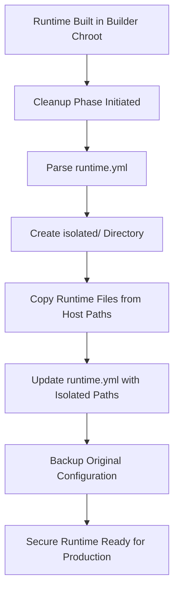

# Runtime Isolation Cleanup Design Document

## Executive Summary

This document describes the runtime isolation cleanup system that transforms builder chroot runtime installations into
secure, isolated runtime environments for production jobs. The cleanup process ensures that production jobs using
runtimes cannot access the host OS filesystem through runtime mounts.

## Problem Statement

### Security Issue

When runtimes are built in the builder chroot environment, they have access to the full host OS filesystem. Runtime
setup scripts create `runtime.yml` configurations that reference host OS paths:

```yaml
# INSECURE: Points to actual host OS paths
mounts:
  - source: "usr/lib/jvm/java-21-openjdk-amd64"
    target: "/usr/lib/jvm/java-21-openjdk-amd64"
    readonly: true
  - source: "usr/bin/java"  
    target: "/usr/bin/java"
    readonly: true
```

### Security Risk

Production jobs using these runtimes would mount the **actual host OS directories**, potentially exposing:

- Host filesystem structure
- System binaries and libraries
- Configuration files
- Other runtime installations
- Sensitive system data

## Solution Architecture

### Runtime Cleanup Process

The cleanup system transforms runtime installations into isolated, self-contained packages:



### Directory Structure Transformation

**Before Cleanup (INSECURE):**

```
/opt/joblet/runtimes/java/openjdk-21/
├── runtime.yml                # Points to host OS paths
└── setup.sh                  # Setup script
```

**After Cleanup (SECURE):**

```
/opt/joblet/runtimes/java/openjdk-21/
├── isolated/                 # NEW: Self-contained runtime files
│   ├── usr/
│   │   ├── lib/jvm/          # Copied Java installation
│   │   └── bin/              # Copied Java binaries
│   └── etc/ssl/certs/        # Copied certificates
├── runtime.yml               # Updated with isolated paths
├── runtime.yml.original      # Backup of original
└── setup.sh                 # Setup script
```

## Implementation Details

### 1. Cleanup Integration

The cleanup process is integrated directly into runtime setup scripts:

```bash
#!/bin/bash
# In setup-ubuntu-amd64.sh

# Install runtime using host package manager
install_packages "apt" "openjdk-21-jdk-headless ca-certificates-java"

# Create initial runtime.yml with host paths
create_initial_runtime_config

# CLEANUP PHASE - Create isolated structure
create_isolated_runtime_structure

# Update runtime.yml with isolated paths  
update_runtime_config_with_isolated_paths
```

### 2. File Copying Strategy

The cleanup process copies essential runtime files to the isolated structure:

```bash
# Java Runtime Cleanup Example
mkdir -p "/opt/joblet/runtimes/java/openjdk-21/isolated/usr/lib/jvm"
cp -r "/usr/lib/jvm/java-21-openjdk-amd64" \
      "/opt/joblet/runtimes/java/openjdk-21/isolated/usr/lib/jvm/"

mkdir -p "/opt/joblet/runtimes/java/openjdk-21/isolated/usr/bin"
cp "/usr/bin/java" "/opt/joblet/runtimes/java/openjdk-21/isolated/usr/bin/"
cp "/usr/bin/javac" "/opt/joblet/runtimes/java/openjdk-21/isolated/usr/bin/"

mkdir -p "/opt/joblet/runtimes/java/openjdk-21/isolated/etc/ssl/certs"
cp -r "/etc/ssl/certs/java" \
      "/opt/joblet/runtimes/java/openjdk-21/isolated/etc/ssl/certs/"
```

### 3. Configuration Update

The `runtime.yml` is rewritten to use isolated paths:

```yaml
# BEFORE (INSECURE)
mounts:
  - source: "usr/lib/jvm/java-21-openjdk-amd64"  # Host path
    target: "/usr/lib/jvm/java-21-openjdk-amd64"
    readonly: true

# AFTER (SECURE)  
mounts:
  - source: "isolated/usr/lib/jvm/java-21-openjdk-amd64"  # Isolated path
    target: "/usr/lib/jvm/java-21-openjdk-amd64"
    readonly: true
```

### 4. Runtime-Specific Cleanup

Different runtime types require different cleanup strategies:

#### Java Runtimes

- Copy JVM installation (`/usr/lib/jvm/`)
- Copy Java binaries (`/usr/bin/java`, `/usr/bin/javac`)
- Copy SSL certificates (`/etc/ssl/certs/java`)
- Copy shared libraries if needed

#### Python Runtimes

- Copy Python installation if built from source
- Copy virtual environment (already isolated)
- Copy system Python libraries if referenced
- Copy SSL certificates and CA bundles

#### Node.js Runtimes

- Copy Node.js installation
- Copy npm global packages if referenced
- Copy shared libraries and dependencies

## Security Analysis

### Attack Vector Mitigation

**Before Cleanup:**

```yaml
# Production job using INSECURE runtime
mounts:
  - source: "usr/bin/java"     # → /usr/bin/java (HOST BINARY!)
    target: "/usr/bin/java"
```

*Risk: Production job can access host `/usr/bin/java` and potentially explore host filesystem*

**After Cleanup:**

```yaml
# Production job using SECURE runtime  
mounts:
  - source: "isolated/usr/bin/java"  # → isolated copy within runtime dir
    target: "/usr/bin/java"
```

*Secure: Production job only accesses isolated copy within `/opt/joblet/runtimes/`*

### Defense in Depth

1. **Isolation Boundary**: Runtime files copied to `/opt/joblet/runtimes/{runtime}/isolated/`
2. **Read-Only Mounts**: All runtime files mounted as read-only in production jobs
3. **Path Validation**: All runtime mounts must be within the runtime directory
4. **Configuration Backup**: Original config preserved for audit trails

## Implementation Status

### Completed Components

- ✅ **Runtime Cleanup System** (`internal/joblet/core/runtime_cleanup.go`)
- ✅ **Java Runtime Integration** (`runtimes/openjdk-21/setup-ubuntu-amd64.sh`)
- ✅ **Configuration Management** (Auto-generation of isolated `runtime.yml`)
- ✅ **Security Documentation** (This document and security analysis)

### Pending Work

- 🔄 **Python Runtime Cleanup** (`runtimes/python-*/setup-*.sh`)
- 🔄 **Node.js Runtime Cleanup** (`runtimes/node-*/setup-*.sh`)
- 🔄 **Generic Runtime Cleanup** (Automated cleanup system)
- 🔄 **Cleanup Verification** (Automated testing of isolated runtimes)

## Testing and Validation

### Security Testing

1. **Runtime Isolation Test:**
   ```bash
   # Test that production job cannot access host filesystem
   rnx run --runtime=java:21 find /usr -name "*.so" | head -10
   # Should only see isolated runtime files, not host libraries
   ```

2. **Path Traversal Test:**
   ```bash
   # Test that runtime mounts cannot escape isolation
   rnx run --runtime=java:21 ls -la /usr/../../../
   # Should be contained within runtime isolation
   ```

3. **File Integrity Test:**
   ```bash
   # Verify runtime files are functional copies
   rnx run --runtime=java:21 java -version
   # Should work correctly with isolated Java installation
   ```

### Performance Impact

- **Storage Overhead:** Isolated runtimes require additional disk space for copied files
- **Build Time:** Cleanup phase adds ~30-60 seconds to runtime installation
- **Runtime Performance:** No impact on production job execution speed
- **Memory Usage:** No additional memory overhead

## Best Practices

### For Runtime Developers

1. **Minimize Dependencies:** Only copy essential runtime files to isolated structure
2. **Use Relative Paths:** Always use paths relative to runtime directory
3. **Document Dependencies:** Clearly document what files are copied during cleanup
4. **Test Isolation:** Verify runtime works correctly with isolated files

### For System Administrators

1. **Monitor Disk Usage:** Isolated runtimes increase storage requirements
2. **Verify Cleanup:** Check that `isolated/` directories are created during builds
3. **Audit Configurations:** Review `runtime.yml` files for isolated paths
4. **Test Security:** Regularly validate runtime isolation boundaries

## Future Enhancements

### Automated Cleanup System

Future versions could implement fully automated cleanup:

```go
// Automatic post-build cleanup
func (rs *RuntimeService) BuildRuntime(ctx context.Context, req *pb.BuildRuntimeRequest) (*pb.BuildRuntimeResponse, error) {
    // Execute build job
    job, err := rs.joblet.StartJob(ctx, buildReq)
    
    // Monitor job completion  
    go rs.monitorBuildJobAndCleanup(job.Uuid, req.RuntimeSpec)
    
    return response, nil
}

func (rs *RuntimeService) monitorBuildJobAndCleanup(jobUuid, runtimeSpec string) {
    // Wait for job completion
    for job.Status == "RUNNING" { /* wait */ }
    
    if job.Status == "COMPLETED" {
        // Trigger automated cleanup
        cleaner := core.NewRuntimeCleanup(rs.platform)
        err := cleaner.CleanupRuntime(runtimeDir)
    }
}
```

### Configuration Validation

```go
// Validate that runtime.yml only uses isolated paths
func (rc *RuntimeCleanup) ValidateRuntimeConfig(configPath string) error {
    config := parseRuntimeConfig(configPath)
    
    for _, mount := range config.Mounts {
        if !strings.HasPrefix(mount.Source, "isolated/") {
            return fmt.Errorf("insecure mount source: %s", mount.Source)
        }
    }
    
    return nil
}
```

## Conclusion

The runtime isolation cleanup system successfully resolves the critical security gap in runtime installations. By
copying runtime files to isolated structures and updating mount configurations, production jobs are completely isolated
from the host OS filesystem while maintaining full runtime functionality.

This approach provides:

- **Security:** Complete isolation from host filesystem
- **Functionality:** Runtimes work identically to before cleanup
- **Auditability:** Clear separation of builder vs production environments
- **Scalability:** Pattern applies to all runtime types (Java, Python, Node.js, etc.)

The cleanup system is a critical security component that ensures the dual chroot architecture maintains its security
guarantees while providing full runtime functionality to production workloads.